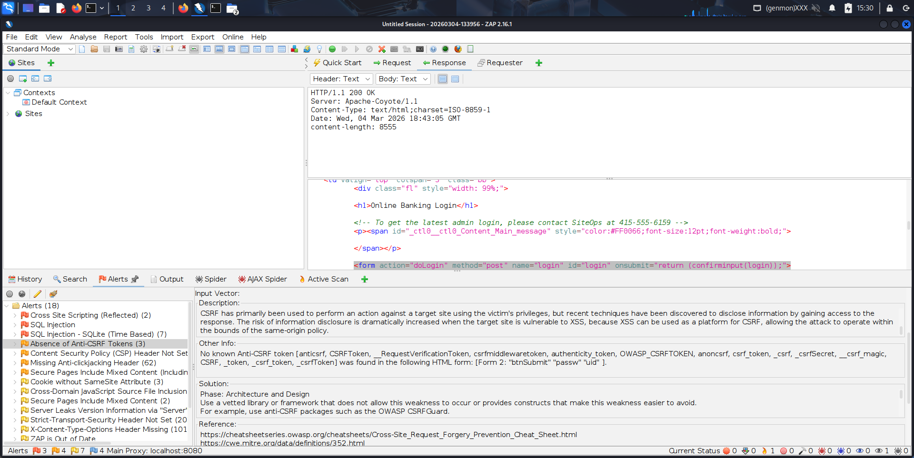

# FUTURE_CS_01 — Vulnerability Assessment Report



## About This Task

This repository is the submission for **Task 1** of the **Future Interns Cyber Security Track (2026)**.

**Task:** Perform a passive vulnerability assessment on a live (authorized) website, produce a professional security report, and document the full methodology with evidence.

---

## Target Website

| Field | Details |
|---|---|
| **Site** | Altoro Mutual — `https://demo.testfire.net` |
| **Reason for selection** | Publicly authorized test banking application by HCL Technologies, designed for security testing |
| **Scope** | Read-only passive analysis — no exploitation |

---

## Tools Used

| Tool | Purpose |
|---|---|
| Kali Linux | Operating environment |
| Nmap v7.95 | Port scanning & service enumeration |
| Nikto v2.5.0 | Web vulnerability scanning |
| WhatWeb | Technology fingerprinting |
| OWASP ZAP v2.16.1 | Automated passive web application scanning |

---

## Repository Structure

```
FUTURE_CS_01/
├── VAPT_Report.md              # Full professional assessment report
├── Step_by_Step_Methodology.md # Step-by-step documentation with screenshots
├── README.md                   # This file
└── evidence/
    ├── nmap_scan.nmap          # Nmap scan output
    ├── nikto_results.txt       # Nikto vulnerability scan
    ├── whatweb_results.txt     # Technology fingerprint
    └── Screenshots/            # Visual evidence from ZAP, Nikto, Nmap
```

---

## Key Deliverables

- [**Full VAPT Report**](VAPT_Report.md) — Professional assessment report (15 findings, 4 Medium · 7 Low · 4 Informational). Use this for your Canva PDF design.
- [**Step-by-Step Methodology**](Step_by_Step_Methodology.md) — How the assessment was conducted, with screenshots.

---

*Submitted by: Patrick Leon | Future Interns Cyber Security Program 2026*
