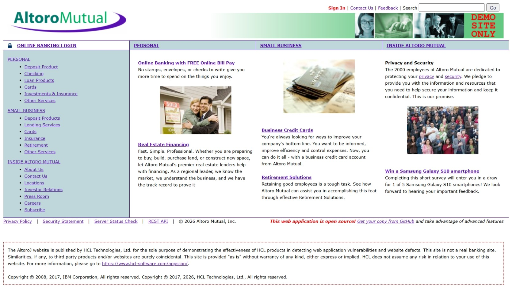
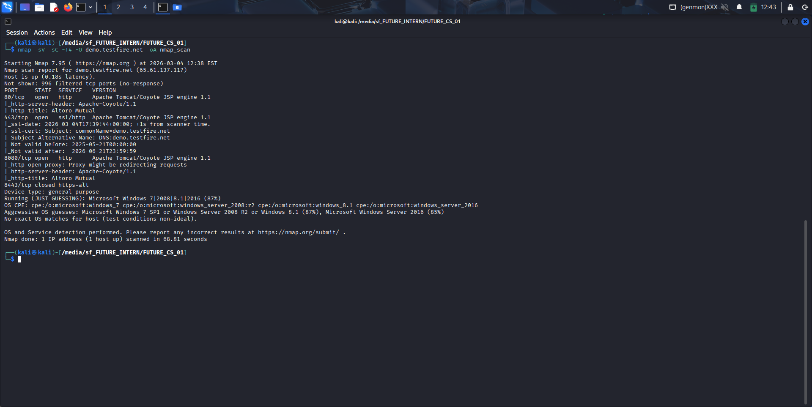
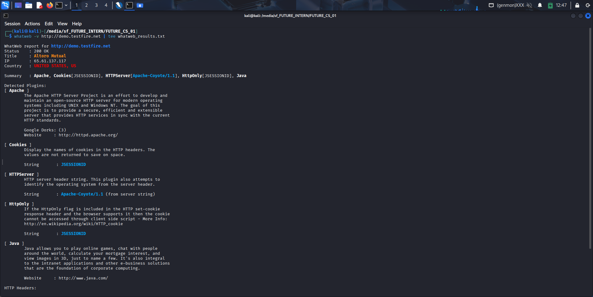
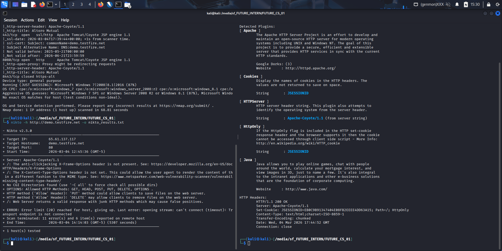

# FUTURE_CS_01 - Vulnerability Assessment Report

## Project Overview

This repository contains the deliverables for Task 1 of the Future Interns Cyber Security Track (2026).
The objective was to perform a comprehensive, passive vulnerability assessment on a live authorized test application and produce a client-ready security report. The assessment demonstrates the ability to identify, classify, and communicate web application vulnerabilities with their corresponding business impacts and remediation strategies.

## Target Details

- Target Application: Altoro Mutual (`demo.testfire.net`)
- Scope: Publicly accessible HTTP/HTTPS pages.
- Assessment Type: Read-Only / Passive Vulnerability Assessment (No active exploitation).

## Methodology & Tools Used

The assessment followed a structured methodology to ensure comprehensive coverage without disrupting the target service:

1. Reconnaissance & OSINT
2. Port & Service Enumeration (`Nmap v7.95`)
   
3. Technology Fingerprinting (`WhatWeb`)
4. Web Server Misconfiguration Scanning (`Nikto v2.5.0`)
   
5. Automated Application-Level Passive Scanning (`OWASP ZAP v2.16.1`)
   

## Key Findings Summary

The passive assessment identified 15 distinct vulnerabilities across varying severity levels. Key infrastructure weaknesses include:

- Missing Anti-CSRF Tokens on sensitive forms.
- Complete absence of critical security headers (Content-Security-Policy, X-Frame-Options, Strict-Transport-Security).
- Information Disclosure identifying highly outdated server infrastructure (Apache Tomcat Coyote 1.1).

*Note: For a detailed breakdown of all 15 findings, their business impacts, and the priority remediation plan, please review the final PDF Deliverable.*

## Deliverables

- The final Vulnerability Assessment Report (`.pdf` and `.pptx`).
- `evidence/`: Directory containing raw cryptographic tool outputs (`.nmap`, `.txt`) and the complete archive of assessment screenshots.
